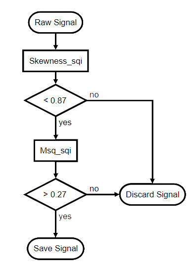

# Vital_sqi: Signal quality control of physiological signals

<!-- [](https://travis-ci.com/meta00/vital_sqi)
[](https://codecov.io/gh/meta00/vital_sqi)
[](https://vitalsqi.readthedocs.io/en/latest/?badge=latest)
[](https://badge.fury.io/py/vital-sqi)
[](https://opensource.org/licenses/MIT) -->


[](https://coveralls.io/github/Oucru-Innovations/vital-sqi?branch=main)
<!-- [](https://opensource.org/licenses/MIT) -->


[](https://vital-sqi.readthedocs.io/en/latest/?badge=latest)
<!-- 
[](https://badge.fury.io/py/vitalsqi)
[](https://colab.research.google.com/github/Oucru-Innovations/vital-sqi/blob/main/docs/source/notebooks/synthesize_data.ipynb) -->

# Description
Vital_sqi is a Python package for signal quality index (SQI) extraction and quality assignment 
for ECG and PPG waveforms. The package provides:

1. Support PPG and ECG waveforms in various data formats extracted from wearables.
2. Unified point of access for the current state-of-the-art SQIs: standard statistics, HRV, RR interval, and waveform based SQIs.
3. Rule-based classification of signal quality using user-defined thresholds for the extracted SQIs per signal segment.
4. Pipeline and GUIs for SQI extraction and quality assignment. 

# Prerequisites and Installation

The package works with `Python 3.7` and `Python 3.8`.

```cmd
pip install vital-sqi
```

# Getting started
The package is built around three classes: `SignalSQI` `Rule` `Ruleset`

1. `signal_obj` `SignalSQI` object, has the following attributes:
    - `signal_obj.signal` containing waveform data (pandas dataframe).
    - `signal_obj.sampling_rate` containing sampling rate, either input by user or automatically inferred from the waveform.
    - `signal_obj.sqis` containing SQIs (pandas dataframe) that are derived by functions of `vital_sqi.sqi` modules or an 
    external table, with SQI values as columns and signal segments as rows. After signal classification, decision of
      `accept` or `reject` for each signal segment is in `decision` column. If signal segmentation is done with the package,
      the table will contain also coordinates in column `start` and `end`.
    - `signal_obj.rules` and `signal_obj.ruleset` containing a list of `rules` and a `ruleset` used for signal classification.
2. `rules` list of `Rule` objects, in which each corresponds to an SQI and contains thresholds for quality assignment. 
    Rules could be read into `signal_obj` from `.json` file in the following format:
  ```python
    "test_sqi": {
        "name": "test_sqi",
        "def": [
            {"op": ">", "value": "10", "label": "reject"},
            {"op": ">=", "value": "3", "label": "accept"},
            {"op": "<", "value": "3", "label": "reject"}],
        "desc": "",
        "ref": ""
  }
  ```
3. `ruleset` object of class `Ruleset` contains a set of selected `rules` (selected from the list of rules in `signal_obj.rule`) and the order to apply them in quality 
assignment (see schema below). Notice that this is not a tree-based classification.
  


## Pipelines
The package includes two pipelines for ECG (similarly for PPG) data as follows:
- `vital_sqi.pipeline_highlevel.get_ecg_sqis` to extract SQIs for ECG segments.
  ```python
    from vital_sqi.pipeline.pipeline_highlevel import *
    from vital_sqi.data.signal_sqi_class import SignalSQI
    import os
    file_in = os.path.abspath('tests/test_data/example.edf')
    sqi_dict = os.path.abspath('tests/test_data/sqi_dict.json')
    segments, signal_sqi_obj = get_ecg_sqis(file_in, sqi_dict, 'edf')
  ```  

- `vital_sqi.pipeline_highlevel.get_qualified_ecg` to extract SQIs, use those to classify ECG signal as `accept` or
  `reject` using user-defined thresholds. The `rules` and `ruleset` are defined in json format. Templates are found in 
  `vital_sqi/resource` folder: `sqi_dict.json` for `rules` and `rule_dict_test.json` for `ruleset`. 
  ```python
    from vital_sqi.pipeline.pipeline_highlevel import *
    from vital_sqi.data.signal_sqi_class import SignalSQI
    import os
    file_in = os.path.abspath('tests/test_data/example.edf')
    sqi_dict = os.path.abspath('tests/test_data/sqi_dict.json')
    rule_dict_filename = os.path.abspath('tests/test_data/rule_dict_test.json')
    ruleset_order = {3: 'skewness_1', 2: 'entropy', 1: 'perfusion'}
    output_dir = tempfile.gettempdir()
    signal_obj = get_qualified_ecg(file_name=file_in,
                        sqi_dict_filename=sqi_dict,
                        file_type='edf', duration=30,
                        rule_dict_filename=rule_dict_filename,
                        ruleset_order=ruleset_order,
                        output_dir=output_dir)
  ```

We also provide an GUI to easily define `rule` and `ruleset`, and execute them with an input SQI table (Help - hyperlink to readthedocs)

## Main steps
Following are the main steps to use the package for SQI extraction and signal classification. For details, see the 
[documentation](https://vitalsqi.readthedocs.io/en/latest/).

**1. Reading/Writing** 
   
Signal waveform is read into an object of `SignalSQI` class and written to the following format using `vital_sqi.data` 
module.
   - ECG: EDF, MIT (physio.net), csv.
   - PPG: csv.
Classified segments are written to csv files using `vital_sqi.preprocess.segment_split.save_segment`
     
**2.Preprocessing and segmentation**
   `vital_sqi.preprocessing` allows doing:
- Several signal preprocessing steps such as trimming, tapering, smoothing, bandpass filter etc. For PPG, 
it is possible to filter the signal based on columns such as SpO2, perfusion, etc.
- Signal segmentation has two options: splitting by duration and by beat (which includes beat detection).

**3. SQI extraction**

The implemented SQIs, `vital_sqi.sqi` module, are divided into 4 groups: 
- Standard statistics SQIs such as kurtosis, skewness, entropy, etc.
- Heart rate variability (HRV) based SQIs such as sdnn, sdsd, rmssd, etc.
- RR interval-based SQIs such as ectopic, correlogram, msq, etc.
- Waveform-based SQIs: dtw, qrs_energy, qrs_a etc.

The function `vital_sqi.pipeline_function.extract_sqi` is used to extract a number of SQIs from segments. The requested SQIs
are defined in a json file called SQI dictionary. We provide a dictionary template for all implemented SQIs, with default 
parameters, in `vital_sqi/resource/sqi_dict.json`.

**4. Quality classification**

The package allows making rule set from SQIs and user-defined thresholds for quality classification. A segment assigned 
as `accept` pass all rules in the set, otherwise `reject`. Rules in the set have ordered, which might help to 
improve speed.

We ran brute force threshold searching for an in-house PPG dataset (generated with Smartcare, doubly annotated 
by domain experts) to obtain a set of recommended thresholds, as found in `resource/rule_dict.json`.

# References


